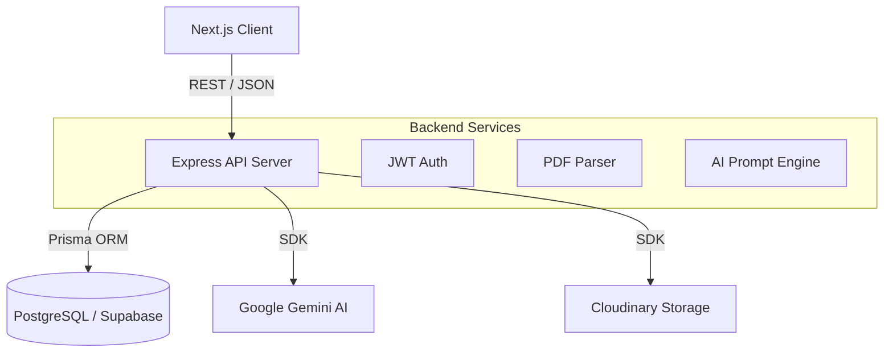

# Prep2Place - AI-Powered Placement Companion

<div align="center">
  
</div>

<p align="center">
  <strong>Land your dream job with personalized, AI-driven placement preparation.</strong>
</p>

<p align="center">
  <a href="#features">Features</a> •
  <a href="#architecture">Architecture</a> •
  <a href="#tech-stack">Tech Stack</a> •
  <a href="#getting-started">Getting Started</a> •
  <a href="#deployment">Deployment</a>
</p>

---

## 🚀 Overview

**Prep2Place** is a comprehensive, AI-powered SaaS platform designed to guide students and job seekers through the entire placement lifecycle. Instead of generic advice, Prep2Place leverages Google's Gemini AI to analyze your resume, assess your career goals, and generate a highly personalized, step-by-step roadmap to get you hired.

*Demo Video/GIF placeholder*

## ✨ Features

- **🧠 AI Resume Analysis**: Upload your PDF resume to receive an instant ATS score, detailed feedback, and actionable improvement suggestions.
- **🗺️ Personalized Roadmaps**: Define your target role and let the AI Career Coach generate a week-by-week learning and preparation mission plan.
- **💬 Interactive AI Career Coach**: Chat directly with an AI coach that knows your profile, resume, and progress, ready to answer questions or conduct mock interviews.
- **📊 Progress Tracking**: A beautiful analytics dashboard to track completed missions, overall readiness, and application status.
- **💼 Opportunities Board**: Discover tailored job opportunities and track your applications via a Kanban-style board (In Progress).
- **🔒 Secure Authentication**: Custom JWT-based authentication system with secure cookie management and password reset flows.

## 🏗️ Architecture

The application is built on a robust, decoupled architecture separating the Next.js frontend from an Express API backend.



## 🛠️ Tech Stack

### Frontend
- **Framework**: Next.js 16 (App Router)
- **Styling**: Tailwind CSS v4
- **Components**: Lucide React (Icons), React Hot Toast (Notifications)
- **Forms**: React Hook Form + Zod validation
- **State Management**: React Context API

### Backend
- **Runtime**: Node.js with Express
- **Language**: TypeScript
- **Database**: PostgreSQL (via Supabase)
- **ORM**: Prisma
- **Storage**: Cloudinary (for secure resume PDF storage)
- **AI Integration**: `@google/genai` (Gemini 2.5 Flash)
- **Authentication**: Custom JWT (JSON Web Tokens) with HTTP-only cookies
- **Security**: Helmet, CORS, Express Rate Limit, bcrypt

## 🚦 Getting Started

### Prerequisites
- Node.js (v18+)
- PostgreSQL database (or Supabase project)
- Cloudinary Account
- Google Gemini API Key

### Installation

1. **Clone the repository**
   ```bash
   git clone https://github.com/yourusername/prepsaathi-ai.git
   cd prepsaathi-ai
   ```

2. **Setup Backend**
   ```bash
   cd server
   npm install
   
   # Copy environment variables
   cp .env.example .env
   
   # Generate Prisma client and push schema
   npx prisma generate
   npx prisma db push
   
   # Start the development server
   npm run dev
   ```

3. **Setup Frontend**
   ```bash
   cd ../client
   npm install
   
   # Copy environment variables
   cp .env.example .env.local
   
   # Start the development server
   npm run dev
   ```

4. **Access the Application**
   Open [http://localhost:3000](http://localhost:3000) in your browser.

## 🌐 Deployment

### Frontend (Vercel)
1. Push your code to GitHub.
2. Import the `client` directory as a new project in Vercel.
3. Add the `NEXT_PUBLIC_API_URL` environment variable pointing to your backend URL.

### Backend (Render / Railway)
1. Deploy the `server` directory as a Node.js Web Service.
2. Set the build command to `npm install && npx prisma generate && npm run build`.
3. Set the start command to `npm start`.
4. Add all required environment variables (`DATABASE_URL`, `JWT_SECRET`, `GEMINI_API_KEY`, etc.).

---

<p align="center">Built with ❤️ for students aiming high.</p>
