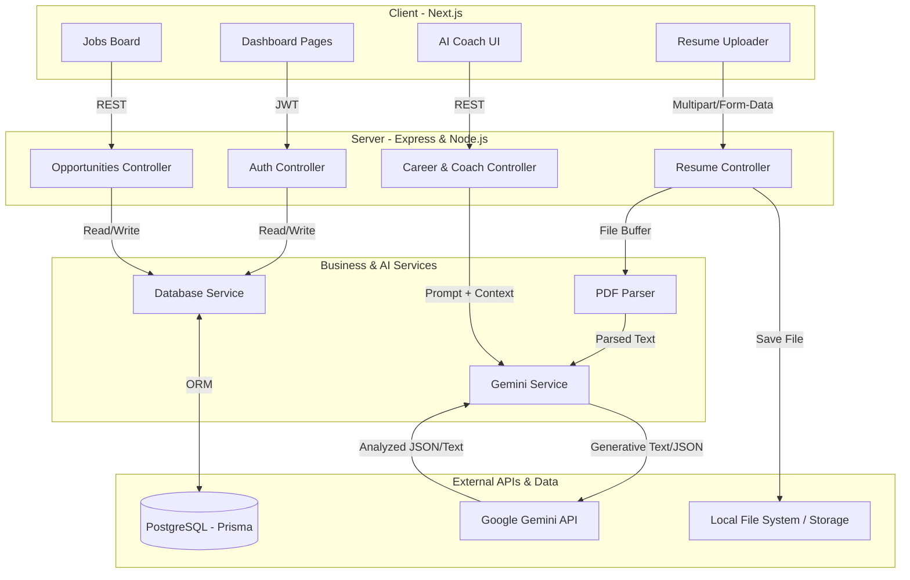

# Architecture Diagram

```mermaid
graph TD
    %% Frontend Layer
    subgraph Frontend [Client - Next.js]
        A[Dashboard Pages]
        B[Resume Uploader]
        C[Jobs Board]
        D[AI Coach UI]
    end

    %% API Layer
    subgraph Backend [Server - Express & Node.js]
        E[Auth Controller]
        F[Resume Controller]
        G[Career & Coach Controller]
        H[Opportunities Controller]
    end

    %% Services Layer
    subgraph Services [Business & AI Services]
        I[PDF Parser]
        J[Gemini Service]
        K[Database Service]
    end

    %% External Systems
    subgraph External [External APIs & Data]
        L[(PostgreSQL - Prisma)]
        M[Google Gemini API]
        N[Local File System / Storage]
    end

    %% Connections
    A -->|JWT| E
    B -->|Multipart/Form-Data| F
    C -->|REST| H
    D -->|REST| G

    E -->|Read/Write| K
    H -->|Read/Write| K

    F -->|File Buffer| I
    I -->|Parsed Text| J
    F -->|Save File| N

    G -->|Prompt + Context| J
    J -->|Generative Text/JSON| M
    M -->|Analyzed JSON/Text| J

    K <-->|ORM| L
```
